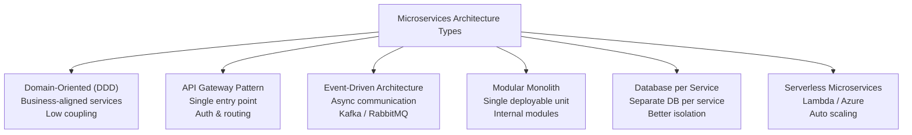

```mermaid
flowchart TB
    A["Microservices Architecture Types"]

    A --> B["Domain-Oriented (DDD)<br>Business-aligned services<br>Low coupling"]

    A --> C["API Gateway Pattern<br>Single entry point<br>Auth & routing"]

    A --> D["Event-Driven Architecture<br>Async communication<br>Kafka / RabbitMQ"]

    A --> E["Modular Monolith<br>Single deployable unit<br>Internal modules"]

    A --> F["Database per Service<br>Separate DB per service<br>Better isolation"]

    A --> G["Serverless Microservices<br>Lambda / Azure<br>Auto scaling"]
```
